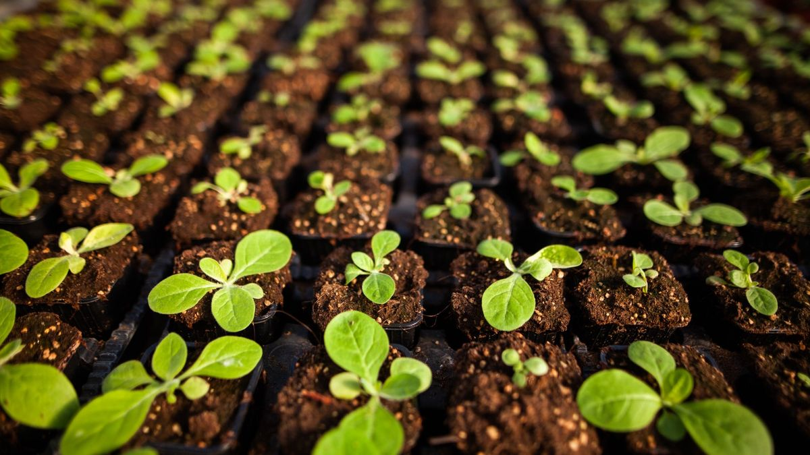

#
<p align="center">
  
</p>

<h1 align="middle">Statistical Modellig of root-to-shoot ratios in Barley Seedlings</h1>

This project demostrates my proficiency in biostatistical modelling and reasoning. I model the marginal distribution of the sprout- and root-mass of 143 barley seedlings using a Gamma distribution. My analysis shows that the proportion of the sprout-mass to the total mass doesnt align with the theoretical Beta distribution (Ratio Distribution), which strongly suggest that the high correlation is statistically supported. 


## Data
This data set was provided by the MLU Halle-Wittenberg (AG Quint, Ertragsphysiologie der Kulturpflanzen, NatFak) during my master's programme. 


## Project Structure
```
root-to-sproot-ratio/  
├── data/                   # The data  
├── notebooks/              # Chronological Pipeline
├── reports/                # Tex documents 
├── .env                    # PYTHONPATH setting
├── environment.yml         # Base environment   
└── README.md               # Just the README  
```

## Note
- For plotting I use a custom matplotlib wrapper that aims to reduce the 
  boilerplate code 
- This is not yet uploaded 