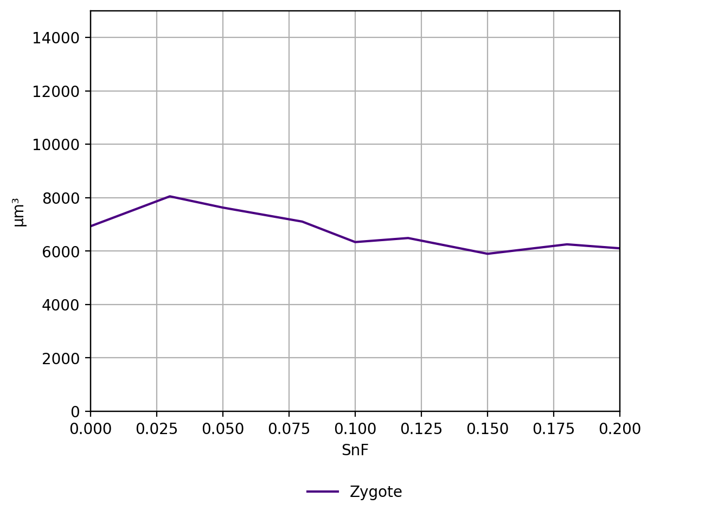
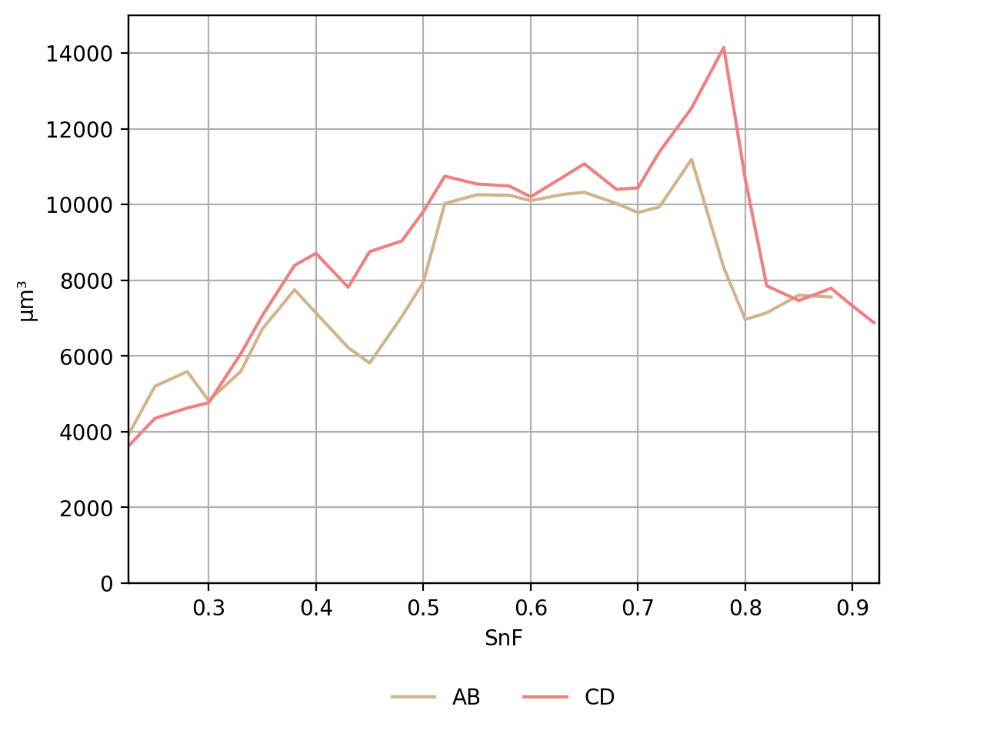
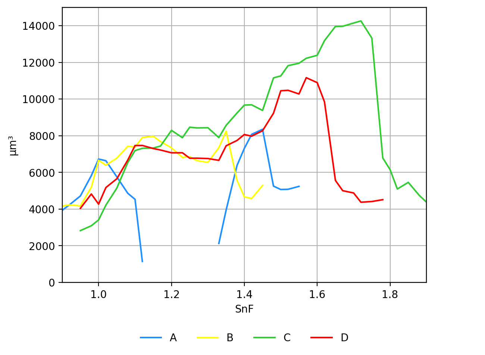
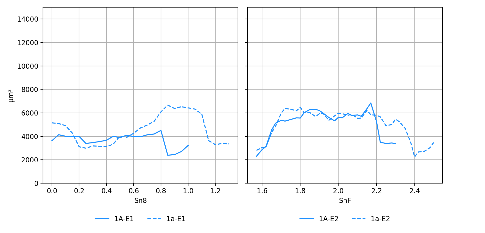
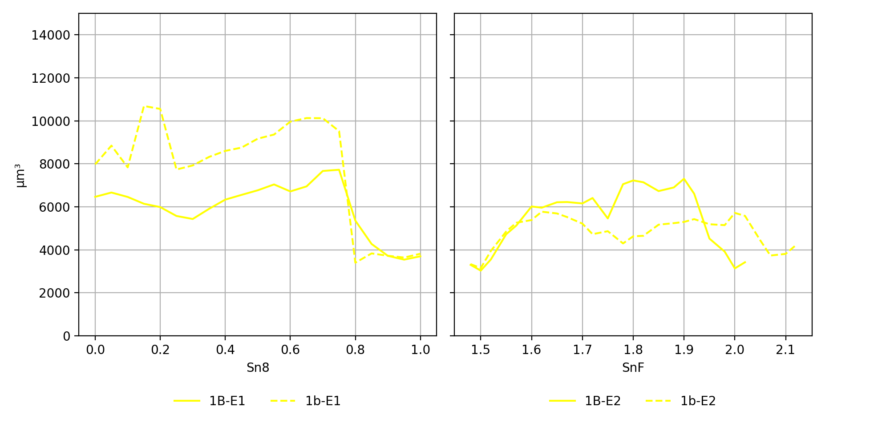
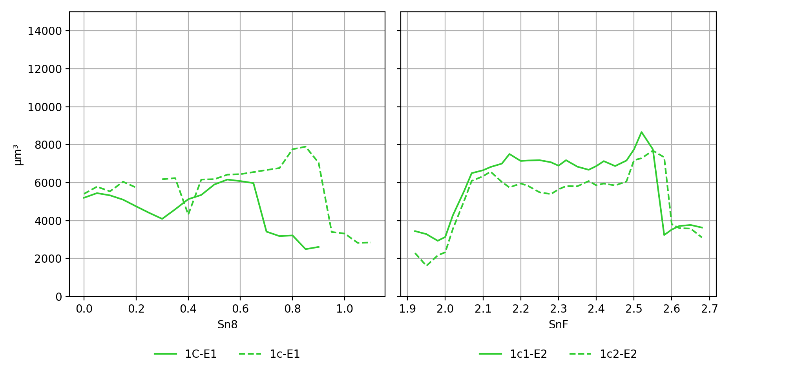
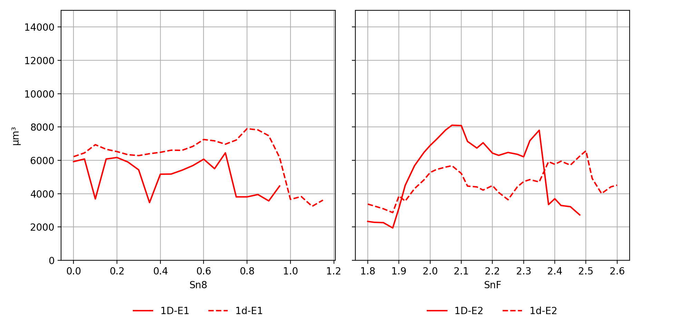

# Bachelor thesis
Quantitative Image-Analysis of Blastomeres in the early embryonic development of *Macrostomum Lignano* (Plathelminthes, Macrostomorpha).  

## Quick Note
I just quickly want to demonstrate the work of my bechlor thesis. This gives a consice overview of the research and tasks that I was involved in. 

## Abstact
The goal of thesis was to apply instance segmentation (supervised) in a developmental biology context and thereby gain new insights into the spatial distribution of cell nuclei during the early embryonic development of Macrostomum lignano, an animal undergoing spiral cleavage. Two *M. lignano* embryos were recorded using light-sheet fluorescence microscopy (SPIM), followed by determing cell lineage trees for both embryos. The model was trained using the dataset from Embryo I and then applied to both embryos. Comparable segmentations of the cell nuclei were obtained for both embryos.

## Background

## Results
#### Model Training History 
History of the training from the model on embryo I. 

  
   

#### Cell Lineage with maximum spatial distribution  
The maximum spatial distribution of the tracked blastomeres in embryo 2 mapped onto the cell lineage (from tracking). 

#### Cell nuclei volume over time from embryo 2
Some example plots from the quantitative analysis of emryo 2.

    
     
     

#### Cell nuclei voulme comarison over time

    
     
     
     

