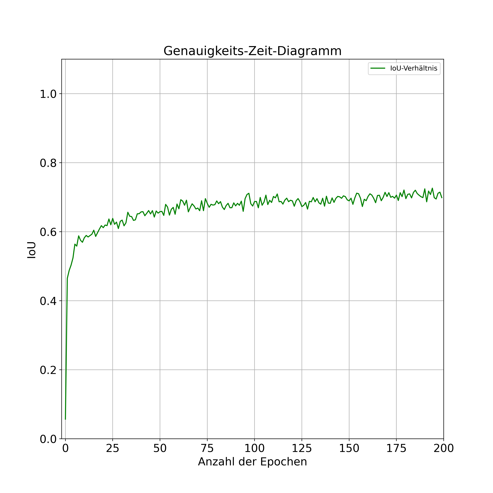

# Bachelor thesis
Quantitative Image-Analysis of Blastomeres in the early embryonic development of *Macrostomum Lignano* (Plathelminthes, Macrostomorpha).  

#### Abstact
The goal of thesis was to apply instance segmentation (supervised) in a developmental biology context and thereby gain new insights into the spatial distribution of cell nuclei during the early embryonic development of Macrostomum lignano, an animal undergoing spiral cleavage. Two *M. lignano* embryos were recorded using light-sheet fluorescence microscopy (SPIM), followed by determing cell lineage trees for both embryos. The model was trained using the dataset from Embryo I and then applied to both embryos. Comparable segmentations of the cell nuclei were obtained for both embryos.

#### Results
Model Training History 

