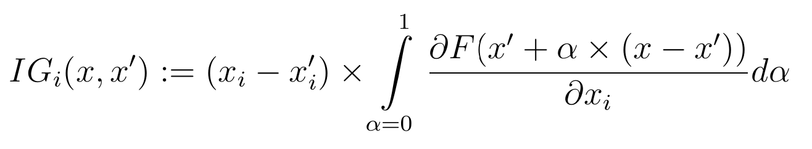
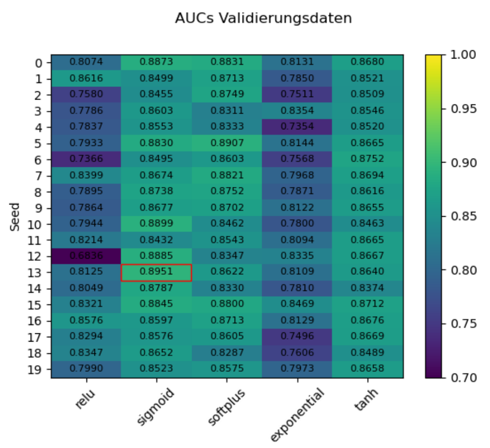
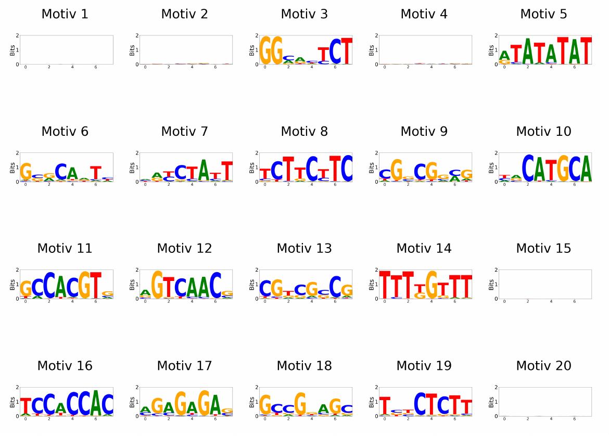
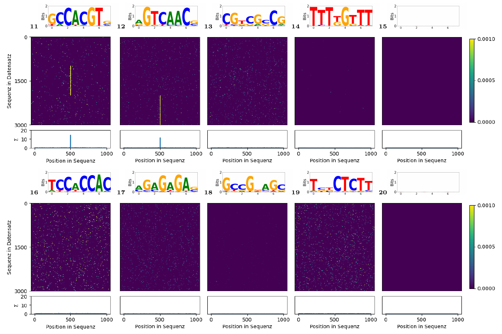

# Master thesis

Methods for interpreting neuronal nets in sequence data analysis.  

## Quick Note

I just quickly want to demonstrate the some aspect of the work of my master thesis. It still gives a consice overview of the research and tasks that I was involved in. I only share the mix data set including multiple motifs. 

## Abstact

The goal of thesis was to combine Integrated Gradients (XAI method) with Binary-CNNs for exploring there value in detecting motif postions in sequential data (DAP-seq). I will not share the exact procedure, but I will graphically demosntrate that it is possible to visualize motif positions even when multiple motifs are included. This cropped data set was given by my superisor an was cropped around the peaks from a mapping. The following data is from the *Arabidopsis thaliana*.   

## Background

- Model 
  
    [DeepBind](https://www.nature.com/articles/nbt.3300) (with an adapted processing)

- Integrated Gradients
  
  

## Results

- Model evaluation
  
  - There was a clear difference in the performance of certain activation functions
  
  - For the downsteam analysis I picked the sigmoid seed 13 (red highlighted)
    
    

- Kernels to Motifs
  
  - One can interpret the kernels of th DeepBind model as a stochastical matrix using Softmax function
    
    

- Motif positions 
  
  - This shows the pseudo corellation of the feature map with the IG procedure that I used in this thesis
  
  - One can clearly see that two motifs signals were clearly detected ([2, 0],[2,1])
  
  - One motif got lost in the pseudo correltion computation ([1,5])
    
    
      
